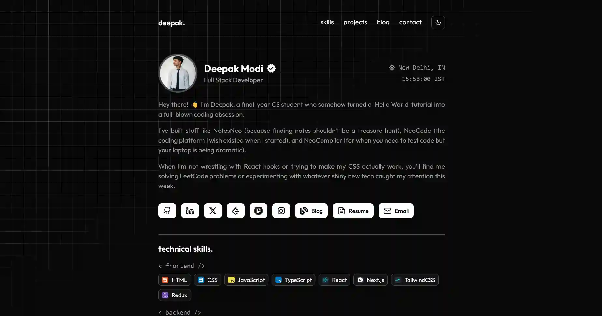

# 🚀 Neo Portfolio CLI & Template

<p align="left">
  <a href="https://github.com/decodewithdeepak/create-neo-portfolio/stargazers" target="_blank">
    
  </a>
  <a href="https://github.com/decodewithdeepak/create-neo-portfolio/network/members" target="_blank">
    
  </a>
  <a href="https://github.com/decodewithdeepak/create-neo-portfolio" target="_blank">
    
  </a>
  <a href="https://www.npmjs.com/package/create-neo-portfolio" target="_blank">
    
  </a>
  <a href="https://www.npmjs.com/package/create-neo-portfolio" target="_blank">
    
  </a>
  
  
</p>

Create a modern, customizable developer portfolio in seconds—using a single CLI command! Built with Next.js, TypeScript, and Tailwind CSS. Perfect for showcasing your projects, skills, and experience with minimal setup.

---

## Reference & Inspiration

**See what you can build:** [decodewithdeepak.vercel.app](https://decodewithdeepak.vercel.app)

<p align="center">
  
</p>

## Quick Start (as a CLI)

1. **Create your portfolio using the CLI:**

```bash
# Interactive mode (will prompt for project name, default: neo-portfolio)
npx create-neo-portfolio

# Or provide a name directly
npx create-neo-portfolio my-portfolio
cd my-portfolio
npm run dev
```

> This will scaffold your portfolio, install dependencies automatically, and start the local dev server.

2. **Edit your content:**

- Open `src/components/constants/data.ts` and fill in your details (name, social links, projects, etc.).
- Update the contact form endpoint (`FORM_ENDPOINT`) with your own Formspree or similar service.
- Cleanup the section you don't need (like blog, if not required).
- Customize sections/components as needed for your portfolio.

3. **Deploy:**

- Deploy to [Vercel](https://vercel.com/import) (recommended) or your favorite platform.

---

## What Can You Build?

- A beautiful, fast, clean and fully responsive developer portfolio
- Show off your projects, experience, education, and skills
- Add a blog, contact form, and more—customize as you like!

---

## Customization

- **Branding:**
  - Change your name/title in `data.ts` and it will update everywhere (navbar, meta tags, etc.).
- **Sections:**
  - Remove or add sections by editing `src/components/sections/` and updating `src/app/page.tsx`.
- **Social Links:**
  - Leave any social link blank in `data.ts` to hide its button automatically.
- **Contact Form:**
  - Set your own endpoint in `FORM_ENDPOINT` in `data.ts`.
- **Blog:**
  - Remove the blog section if you don't need it (see `page.tsx` and `navbar.tsx`).

---

## Features

- Minimal, modern design
- Fully responsive
- Easy to customize
- Dynamic OpenGraph/Twitter images
- Dark and light theme support
- No personal data included—ready for your info!

---

## Credits

- Built with [Next.js](https://nextjs.org/), [Tailwind CSS](https://tailwindcss.com/), and [TypeScript](https://www.typescriptlang.org/)
- Inspired by the open-source dev community

---

## License

[MIT](LICENSE)

---

## Need Help?

Open an issue or reach out on GitHub!
Enjoy building your portfolio! 🚀